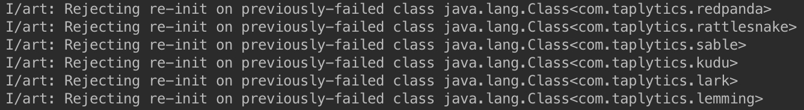

#Taplytics FAQ

##Q. Will the border or shake menu show up on our user's devices?

No.

The border and menu will only ever appear on **_debug devices_** and _release mode devices that have **previously been paired to taplytics**_. 

If a user has a rooted device and modifies your application to be read as debug mode, then yes this may appear. However, if a user is doing that, you will have bigger problems than the Taplytics border.

##Q. What is 'Rejecting Re-Init on Previously Failed Classes'

If you see this:

Its nothing to worry about, at all. 

Taplytics has two different networking options -- Retrofit+OkHttp, or Volley. 

If you choose to use one, the classes/methods relying on the other will be purged out, and that is what you are seeing. 

The animal names are how we obfuscate things!

##Q. How do I pair Taplytics to a release build?

**[You need to have add a few things to your app, as seen here.](https://github.com/taplytics/Taplytics-Android-SDK/blob/master/START.md#device-pairing)**

Also don't forget, your socket library has to be in your release builds (which may not be by default -- ask your devs!)